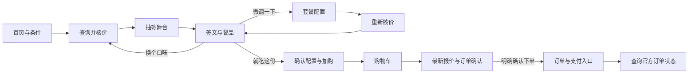

# 界面与交互设计

设计基线：2026-10-09。图为静态概念，正式网页由 Kiro 实现。所有主要流程同时支持手机、电脑；不沿用掌机布局。

## 视觉方向

**暖奶油色的麦麦小舞台。** 红色作为操作重心，金黄色用于签文和庆祝，深棕色正文与手绘轮廓呼应。紫色只留在角色插画，不再用薯条原图的紫色底。

| 设计项 | 值/行为 |
|---|---|
| 页面底色 | `#FFF6E5` |
| 卡片 | `#FFFCF5` |
| 主按钮 | `#B91F1A`，白字 |
| 正文 | `#352119` |
| 次级正文 | `#705448` |
| 金色装饰 | `#F2BD3E`，不用于白底小字 |
| 边线 | `#E7D4B6` |
| 字体 | 系统中文无衬线；正文16px、辅助14px、行高1.6 |
| 标题 | 手机28–32px、电脑40–48px；价格28–32px |
| 间距 | 4/8/12/16/24/32/48px |
| 圆角 | 按钮14px、卡片24px、标签圆角胶囊 |
| 点击区域 | 至少44×44px；主按钮高48px |
| 状态指示 | 文字＋图标/边框，不能只靠红绿颜色 |

不使用像素字、游戏机边框、像素薯条、满屏闪烁和浮夸3D按钮。不把文字、价格、按钮烘焙到图片里。

## 页面地图

## 首页 / 条件页

顶栏：左「今天麦什么」文字标识；右侧模式徽标、购物车数量。开发/演示模式不可隐藏。页脚短注「独立创意项目 · 非官方产品」。

电脑主区域左侧普通店铺完整插画，右侧标题＋条件表单。手机先短标题和小幅欢迎图，再表单，用户不用先滑过整张大图才能开始。

表单顺序固定：用餐方式 → 门店/地址 → 心情 → 不想吃 → 主按钮。条件选项为有边框大卡片，选中用勾选标记，不能只靠颜色。不用“下一步”层层分页收集简单条件。

演示初始状态：模式「演示」，龙腾大道「示例门店」。真实模式需要在本地服务配置后显式选择。未实现外送显示开发中并说明，不假启用。

## 查询 Loading：麦麦圆环（新增参考方向）

2026-10-09用户提供角色与食物围成圆环的图片，表示喜欢，可参考用于loading旋转，并明确“仅作参考”。原图存于`reference/art/loading-ring-reference.png`，1024×1024 RGB；未定为最终素材，不直接加入正式素材库。

设计方向：

- 用于读取菜单、准备候选和核价的等待阶段；数据就绪后立即退出，再开始薯条出签。不能为了播满一圈拖延结果。
- 外围角色/食物圆环顺时针缓慢匀速转动，建议12秒一圈；中间文案独立为HTML，保持静止。整页和提示文字不转动。
- 中间两行：“麦麦正在集合…”／“看看今天有什么合你胃口”。下方用实际请求阶段提示“正在查看门店菜单”“正在确认搭配价格”；不显示虚构百分比。
- 手机圆环建议直径240–280px，电脑320–360px；按可用宽度缩放，不做铺满屏幕的大转盘。中心文案保持可读字号，重试/返回按钮放圆环之外。
- 原图外部奶油背景、中央白色均不透明。最终若采用该方向，需保留环形插画、处理内外背景为透明，并预留旋转安全边距，避免方形底随图旋转、白色中心色块或外缘裁切。当前只保存参考，不处理或重绘原图。
- 请求很快时无需闪现大loading；持续约300ms后再展示。等待较久时给出真实等待说明和返回入口；失败进入错误状态，停止旋转并允许重试。
- `prefers-reduced-motion`显示静态圆环；隐藏标签页暂停装饰动画。插画标为装饰，状态文字可由屏幕阅读器读取，不连续重复播报。

此参考不替代薯条签筒，也不改变庆祝和安慰场景。正式应用实现仍由Kiro负责，当前未实现旋转或验收浏览器效果。

## 抽签舞台

使用透明 `fries.png`，放在纯奶油色圆角舞台中，下方柔和CSS椭圆阴影。舞台顶部小标签「这份惊喜，正在路上」；底部查询状态/跳过按钮。四个店铺角色已在背景里，不另拆角色做动作。

先用本地CSS对整筒摆动，抽出的单根薯条可以由CSS矩形圆角+阴影绘制，不要求再生成PNG。网络等待采用上方圆环参考方向，薯条签筒只负责出签，不当作旋转加载器。出签动画依赖数据ready事件，不等网络。

## 揭晓页

电脑：左侧完整场景，占约52%；右侧卡片，占约48%。两列gap32px，阅读宽度不超过520px。正常流布局，不固定整页高度。

手机：标题/等级 → 完整场景 → 签文 → 餐品清单 → 报价 → 操作。方形图宽度随容器，最高不强行占满一屏。普通图保持1024:709原比例，其他保持1:1。

餐品卡：

1. 「大吉」小标签＋「这一餐，值得好好期待」标题。
2. 两行正文签文，视觉上与事实理由分开。
3. 真实餐品缩略图64–80px＋正式名称＋规格＋数量；图片失败使用中性餐具图标，不换成不对应的汉堡图。
4. 事实理由：「保留了你选的无糖饮料」「这份套餐可把薯条换成玉米杯」等，只有来源支持才写。
5. 大号本次应付，费用细项可展开。优惠旁显示适用条件，不用巨大的未验证“省了xx”。
6. 小字「刚刚核价/xx:xx更新」，历史示例必须显示具体日期＋示例。
7. 「就吃这份」满宽主按钮；下方「换个口味」与「微调一下」。按钮下面可有「修改条件」。

手机订单动作保持正常文档流；若后续用固定底栏，必须给正文预留高度和 `safe-area-inset-bottom`，不得挡住清单末项。

## 小吉安慰

场景 `shop-comfort.png`，标题「慢慢来也很好」，正文「今天先照顾好自己，别的事一件件来。」

没有哭脸、凶字、失败声音、灰暗页面和必须重抽的暗示。按钮顺序、价格、优惠规则与大吉完全相同。大吉/超级大吉用同一金色场景，超级大吉可多一圈短暂光晕，不需要额外图片。

## 微调、购物车、确认

微调在手机使用全页，在电脑可用带标题的模态面板，Esc关闭、焦点限制和关闭后返回原触发按钮。按接口round组织配餐/饮品；显示当前数量与限选数，非法数量就地提示。

购物车每行包含正式名称、份数、展开配置、删除；改数后标记「核价中」，总额暂不允许提交。错误保留编辑值并解释。确认弹层不能仅有总价，需完整门店/配送或取餐信息。

订单确认页主按钮「确认下单 · ¥xx.xx」；它上面用普通文字说明会创建订单，支付仍需前往官方入口。没有预勾选的购买会员或自动领券动作。

订单状态页把「待支付」「已支付」「失败」「结果待确认」明确分开，不展示推测性的送达倒计时。

## 响应式与无障碍

容器最大宽1200px，电脑左右32px，手机16px。约960px以下改单列，具体以内容不挤压为准；不通过缩小整张画布适应屏幕。320px不出现横向滚动；360/390/768/1024/1440为验收宽度。

- 图片完整contain，不以cover切掉两侧角色；UI用CSS Grid/Flex而非坐标定位。
- 正文对比度目标4.5:1，控件与焦点3:1；正式代码实测。
- Tab依视觉顺序，Enter/Space触发按钮；不能监听全局Enter造成意外下单。
- radio/checkbox采用语义控件，状态区 `aria-live=polite`；价格更新不反复抢焦点。
- 出签完成把焦点移到结果标题，不把屏幕阅读器留在消失按钮；返回恢复原选项。
- 允许200%文字放大、页面缩放与横屏；弹层可滚动。
- `prefers-reduced-motion`取消摇动、放射、粒子，保留短淡入；默认不自动播放声音。
- 不用网络字体作为可阅读的前提。

## 素材与性能

见 [ASSETS.md](ASSETS.md)。原图保留，1024×1024不无故改成2048×2048。WebP等派生压缩可由构建提供，但不能覆盖原图。

首屏只加载普通店铺和薯条；庆祝/安慰场景空闲预载。图片声明宽高防跳动。动态金光用静态CSS背景/少量装饰，三秒内结束并不遮挡文本；不让持续canvas粒子耗手机电。

GitHub的封面、设计总览是独立静态介绍图，不能作为运行截图或浏览器验收证据。
