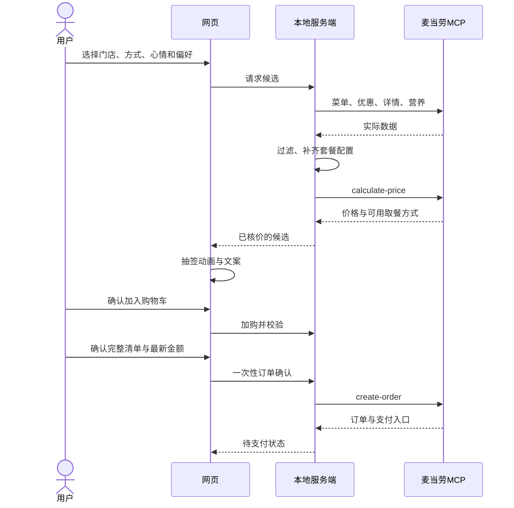

# 麦当劳 MCP 集成

## 当前网页入口

运行 `npm ci`、`npm run live`，打开 `http://127.0.0.1:4177`。Windows 可双击 `start-live.cmd`。在本机网页输入自己的 Token，或启动前设置 `MCD_MCP_TOKEN` 环境变量；两种方式都只在服务内存保留凭据。未连接时显示连接页，不自动退回演示。

当前实现：**网页偏好 → 所选门店 → 菜单与完整配置 → MCP 核价 → 抽签 → 用户确认 → 整份清单重新核价 → 应用购物车**。用户已确认切换至华旭国际大厦餐厅，真实网页链路已验证。

`npm run dev` 和 GitHub Pages 是另一条明确标注的演示入口，不访问开发者账号。真实模式由本机服务注入页面标识；公开构建没有真实模式标识。

### 数据与筛选

- 当前门店 `1450713`：麦当劳上海黄浦华旭国际大厦餐厅，南京东路街道西藏中路336号。到店 `beType=1`、`orderType=1`。配置统一放在 `server/store.mjs`，网页和 CLI 共用。先确认营业状态，再查询菜单、详情和营养。静态演示仍使用原来明确标注的龙腾大道历史数据。
- 每次最多检查 24 个候选，保留最多 5 个已核价结果，查询有时间上限。未成功核价的餐点不进入抽签。
- 套餐按门店返回的轮次、可选项、数量上限及特调配置构建；根据偏好替换可选配餐，不允许前端自造商品和价格。
- 清爽搭配需匹配到具体餐品规格的营养记录，估算整份不超过 650 千卡、蛋白质至少 15 克。不同鸡块数量、饮料大小不会合并；无法识别或每 100g/ml 的记录不用于整份计算。这是项目筛选规则，不是官方健康评级。
- 口味判断使用项目维护的标准餐品名称规则，季节新品或资料不足时保守排除；不是过敏原保证。
- 价格只取 `calculate-price` 的整数分字段，不能用菜单价或旧报价代替。当前**不查询或使用个人优惠券**。

### 购物车与失败处理

候选 ID 仅在当前会话有效，报价采用两分钟软过期策略。加购、改数量、删除后均由服务端重新核整份清单；失败保留原清单并提示重新核价。重复加购请求用操作 ID 去重，版本冲突不会覆盖新清单。浏览器刷新保留当前会话清单，断开账号或重启服务清空。

这是**本应用购物车**，没有独立的官方 MCP 加购物车工具。没有建单、支付接口，也没有自动下单。真实模式不显示演示的模拟下单按钮。

### 实现与验证

| 位置 | 作用 |
|---|---|
| `server/index.mjs` | 本机 HTTP 服务、会话、Origin/Host/CSRF 校验、静态网页 |
| `server/session.mjs` | 真实查询、候选报价、服务端购物车与幂等 |
| `server/catalog.mjs` | 菜单分类、套餐配置、口味与营养匹配 |
| `shared/live-adapter.ts` | 网页到本机业务 API |
| `scripts/mcp-core.mjs` | 官方 MCP SDK、只读工具白名单 |

本轮构建、42 项单元／组件测试、6 项 MCP 测试、9 项服务端测试通过。15 项新增浏览器测试使用真正的网页和 HTTP 服务，仅上游 MCP 使用接口替身；覆盖 360/390/768/1024/1440 宽度的选择、抽签、加购、改量、失败、刷新恢复、闭店与连接断开。原 20 项演示浏览器测试也通过。

```powershell
npm run build
npm test
npm run test:mcp
npm run test:server
npm run test:live-ui
```

浏览器测试默认使用已安装 Chrome。用户随后选择当前营业的华旭国际大厦餐厅，已完成真实网页验证：三种心情均取得真实报价并加购，改数量再次核价，刷新恢复清单。切店后重跑构建、6 项 MCP、9 项服务端和15项浏览器测试，均通过。实际报价与验证范围见 [验证记录](docs/VALIDATION.md)。

仍未实现：个人优惠券、手动套餐微调、外送、真实建单与付款。当前代码、测试和营业验收状态见 [验证记录](docs/VALIDATION.md)。

<details>
<summary>此前的独立只读验证和完整产品设计记录（不是当前网页验收结果）</summary>

## 状态与价值

2026-10-09已通过官方服务完成只读验证。网页目前使用演示适配器；仓库另包含可运行的本机只读入口`scripts/mcp-draw.mjs`，使用官方TypeScript/JavaScript SDK，不将Token交给浏览器。

## 当前可运行入口

`npm run mcp:check`实际调用`list-nutrition-foods`；`npm run mcp:draw`调用`query-nearby-stores`，确认门店营业后继续`query-meals`→`query-meal-detail`→`calculate-price`，完成核价后独立抽取128条签文。仅支持龙腾大道店两种已知主餐的当前默认配置，不做优惠券、偏好筛选或建单；没有有效结果就停止。

2026-10-09 23:45北京时间，新入口实际连接官方服务并成功读取营养表。随后查询龙腾大道店返回未营业，程序输出store-unavailable，未调用后续核价或订单。该闭店分支已实际验证；新入口的完整实时核价待营业时验证，之前21:37的报价属于较早的独立只读验证。

此实现保留了服务端返回的轮次编码，按实际quantity选默认项，携带特调selected/unselected key，并验证整数分金额。6项合同测试覆盖错误响应、默认项数量、特调、闭店短路、成功工具链与失败不回落样例价。工具白名单不包含create-order或其他写工具。

服务地址：`https://mcp.mcd.cn`；传输：Streamable HTTP；请求头：`Authorization: Bearer ${MCD_MCP_TOKEN}`。实际握手服务名`mcd-mcp`、版本1.0.0、协商协议2024-11-05、35个工具；运行时应重新协商，不把此快照当永久能力清单。

MCP让抽签不止返回随机餐名：推荐必须落到特定门店、真实配置、当前可用优惠和完整报价上。没有有效配置和报价，不能进入可购买结果。

## 工具与流程

| 工具 | 用途 | 当前验证 |
|---|---|---|
| `query-nearby-stores` | 选中门店 | 已验证上海龙腾大道搜索 |
| `query-meals` | 查询门店可选菜单及图片地址 | 已返回菜单；图片URL未全部加载验收 |
| `query-meal-detail` | 套餐轮次、选项、数量与特调 | 已验证3个商品 |
| `query-store-coupons` | 当前账户在店可用券 | 已查询；不是所有账户通用 |
| `list-nutrition-foods` | 营养资料 | 已返回，逐套餐规格匹配未完成 |
| `calculate-price` | 完整配置与券、费用核价 | 已验证4组报价 |
| `create-order` | 最终确认后创建订单 | schema已读取，未调用 |

配送地址/配送店和订单查询的准确工具名与schema见 `reference/mcp-tools-schema.json`。Kiro先依据schema实现stub合同测试；未完成真分支不得显示为实时成功。



## 已验证门店与金额

门店：麦当劳上海龙腾大道餐厅；地址：龙腾大道2121号巨无霸魔方1F2F；storeCode `1450398`。查询日期2026-10-09，北京时间21:33–21:37；当前供应与价格需再次查询。

到店：`beType=1`、`orderType=1`，不传配送`beCode`。搜索：`searchType=2`、城市上海、关键词龙腾大道；返回多店，必须核对名称地址，不能取第一条。

菜单125条、15分类，混有非食品、套餐与19个随单购标记项；不是125种可随意抽取的食物。营养返回160行、158不同名称，重复的小杯玉米和盒装牛奶一致。

| 主商品编码 | 配置摘要 | 当次价 |
|---|---|---:|
| 9900005466 | 1100巨无霸＋4810中薯＋3050中可乐 | 3750分 |
| 9900011128 | 1000汉堡＋515106鸡块4块＋6102苹果60g＋3071中无糖可乐 | 2800分 |
| 9900005466 | 1100巨无霸＋4437小玉米＋3071中无糖可乐 | 3650分 |
| 9900014239 | 草莓4900＋当时已有适用券 | 990分，原1400分 |

最后一组券在2026-10-09 23:59:59到期，仅作为条件优惠的历史例子；不附券ID/券码，也不做演示里人人默认享有的券。完整账户响应留在私人验证区，不进入本仓库。

## 实际发现的适配规则

1. `query-meals`类别引用code，商品在`data.meals`映射中；不能把类别或周边误作食物。所有餐品仍须解析当前门店详情。
2. 套餐`rounds`含id/minQuantity/maxQuantity/choices；quote请求使用`roundList[{round, comboItemList:[{code,quantity,modification?}]}]`，以所附schema为准。
3. `isDefault=1`不等于自动选中：麦旋风草莓与奥利奥都标default，但只有草莓quantity=1。须同时校验实际数量和轮次限制。
4. 特调的`selectedKey/unselectedKey/selectedQuantity`按字段要求传递，非空unselectedKey也不能省略。
5. `query-meals.currentPrice`为元字符串；大部分quote金额为整数分；`enjoyed/enjoyable.realDiscount`说明为元。逐字段归一化，禁止全体数字统一除100。
6. 巨无霸菜单原价50.50/现价37.50，quote原价与应付均37.50、discount0。不能把两种口径的差额重复叠加成“省了”。
7. `list-nutrition-foods.data`是紧凑表格文本，不是JSON数组；格式`[160]{productName,...}:\n...`。需解析并验证行数/列数/单位、重复行、名称和规格。无商品ID不能盲按近似名字join，营养表也不证明在售。
8. 本次quote返回`takeWayList`: eat-in（堂食店内用餐）、locker-in（外带店内柜）、locker-out（外带店外柜）。仅展示实际返回的可用项。
9. 外送需`beType=2`、`orderType=2`以及已匹配的addressId/beCode；不复用到店商品上下文。外送全流程尚未验证。
10. 没有独立购物车工具。本应用待购清单由服务端维护，不声称已写入官方App购物车。

## 凭证、模式与交易

配置模板只含环境变量占位符。服务端通过配置解析并持有Token，前端不可读取；未配置真实凭证时只能明确进入demo，不伪装实时。真实数据、Token、couponCode、地址、订单支付串不得提交到GitHub。

默认真实建单关闭。加购、换口味、动画结束均不触发建单；仅完整确认页的明确提交能够调用。建单成功与支付成功分别处理，超时未知结果不能自动重建。具体会话隔离、nonce与恢复规则见 [ARCHITECTURE.md](docs/ARCHITECTURE.md)。

## 证据与复现

此包包含实际工具schema的所需子集、已脱敏的设计参考，不包含个人账户响应或有效凭据。历史只读结果的原始证据由项目所有者私下留存。Kiro交付后要在应用里重新跑一个单品和一个套餐的查询—详情—核价—加购，并记录不含个人资料的结果，才能升级为“应用集成已验证”。

参考：[官方 MCP 使用说明](https://github.com/M-China/mcd-mcp-server)、[官方活动规则](https://github.com/M-China/mcd-developer-innovation-challenge/blob/main/activityGuidelines.md)。

</details>
