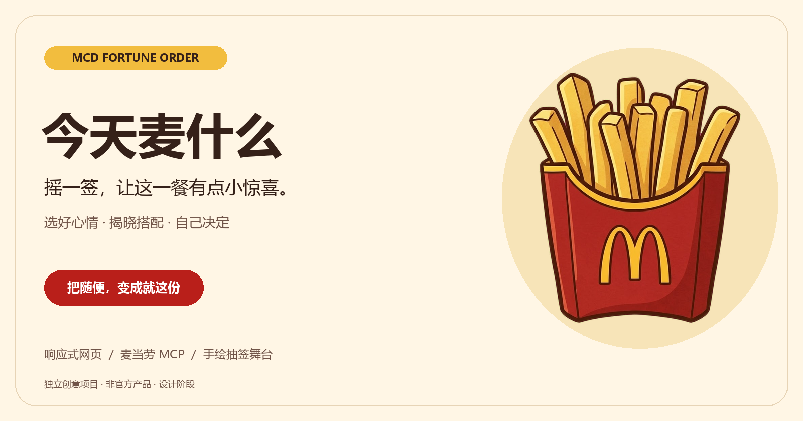
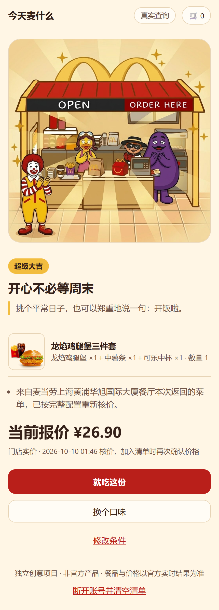
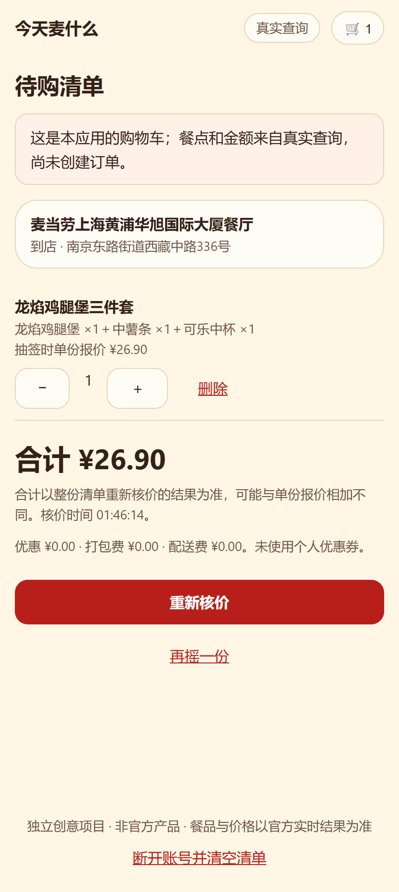
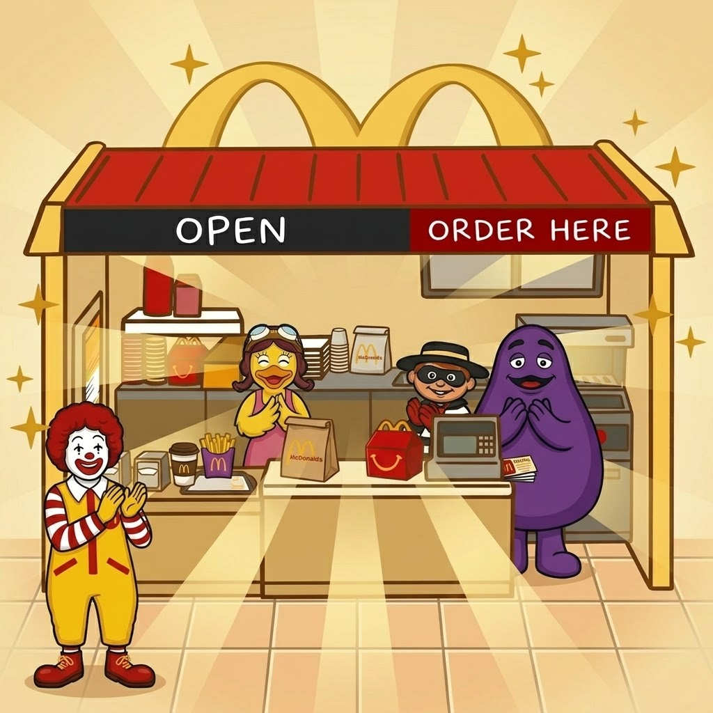
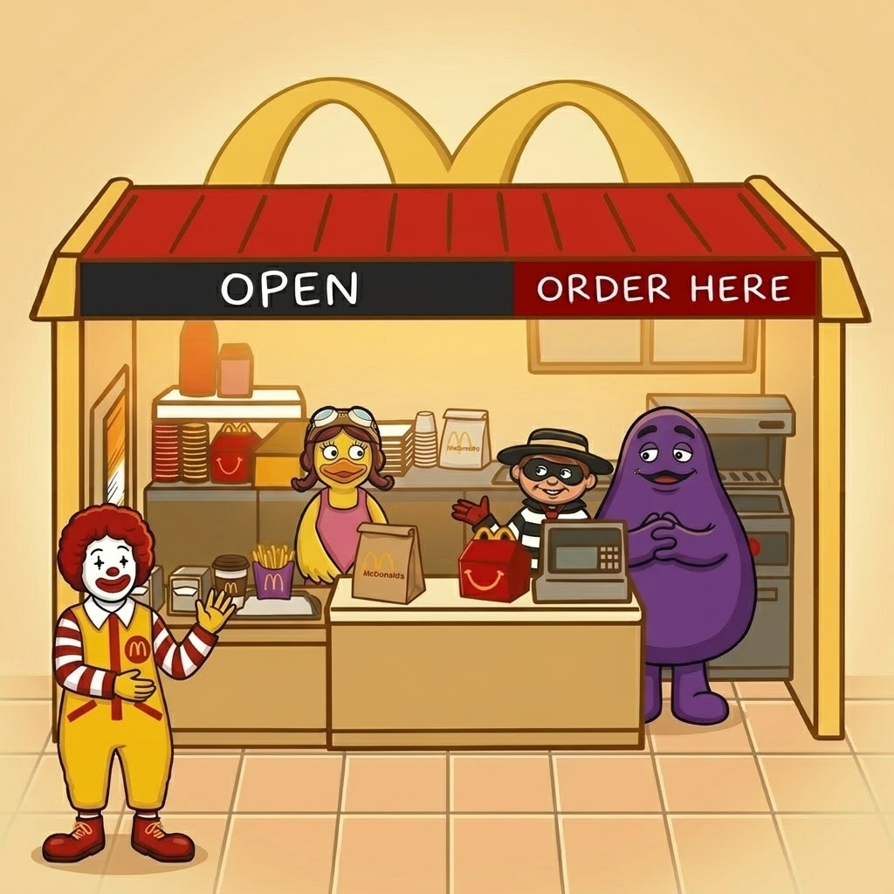
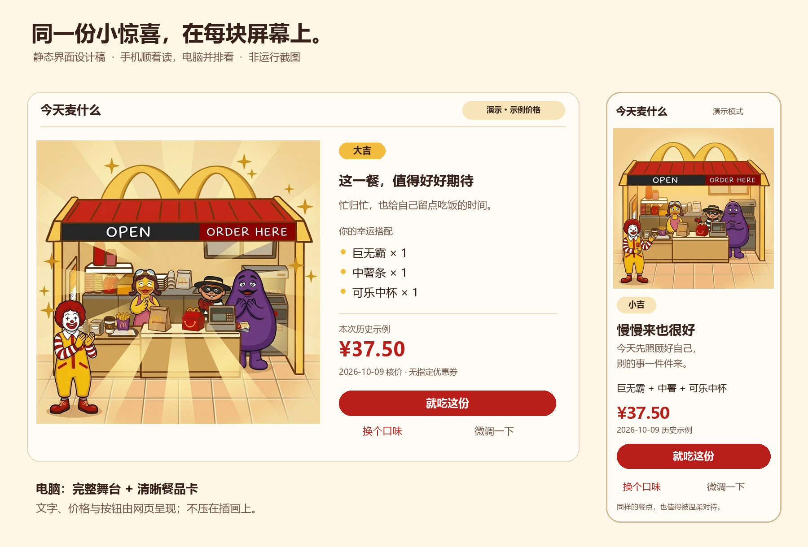

<p align="center">
  
</p>

<h1 align="center">🍟 今天麦什么</h1>
<p align="center"><strong>不知道吃什么？摇一签，让薯条帮你选。</strong></p>
<p align="center">mcd-fortune-order · 128 条签文 · 手机 / 电脑</p>

把薯条盒变成签筒，给午饭加一点仪式感。

选好口味，摇出今天的餐点和一句签文。喜欢就加入购物车，不喜欢就换一份。

> **真实网页链路已验证**：用自己的 MCP Token 查菜单、核价、抽签，再加入应用购物车。已在上海华旭国际大厦餐厅完成真实查询、加购、改量核价和刷新恢复。GitHub Pages 保留免登录演示。

## 怎么玩

1. **选个心情**：今日放纵餐、清爽均衡餐，或来点小确幸。再勾选不想吃的东西，不用填预算。
2. **摇出一签**：先查菜单和价格，再让薯条签筒摇起来，揭晓餐点和今天的签文。
3. **自己拍板**：点「就吃这份」加入购物车，或点「换个口味」再摇一次。

## 真实场景

在上海华旭国际大厦餐厅的真实验证：摇到「龙焰芝士棒鸡腿堡三件套」**¥29.90**，点击「就吃这份」后，MCP 再次核价并加入应用购物车。

| ① 摇出餐点与签文 | ② 确认加购，再次核价 |
|---|---|
|  |  |

以上为实际运行截图，价格仅代表当次查询；**未创建订单、未付款**。[查看验证记录](docs/VALIDATION.md)。

## 有什么好玩的

- **128 条签文**：超级大吉、大吉、中吉、小吉，每一签都有一句话送给你。
- **抽签小舞台**：手绘风格的麦麦店铺、薯条签筒和出签动画。
- **大吉庆祝，小吉安慰**：大吉有金色闪光，小吉也有暖暖的陪伴。签的等级不影响餐点价格。
- **手机电脑都能玩**：手机竖着看，电脑并排看舞台和餐点。

> **超级大吉 · 今天你是主角**  
> 先选一份喜欢的，把吃饭时间留给自己。

| 大吉，一起庆祝 | 小吉，慢慢来也很好 |
|---|---|
|  |  |

<details>
<summary>查看手机与电脑的界面设计稿</summary>



</details>

## 开始真实选餐

安装 Node.js 22 或以上版本，下载项目后，在项目文件夹内打开本地 PowerShell：

```powershell
npm ci
npm run live
```

打开 **http://127.0.0.1:4177**，粘贴自己的麦当劳 MCP Token 即可。Windows 也可以双击 `start-live.cmd`。

Token 只保存在本机服务的内存里。刷新网页会保留清单，断开账号或关闭服务后清空。其他人使用自己的 Token 即可运行，不需要开发者的账号。

「就吃这份」和修改数量都会重新核价。这里的购物车属于本应用，**尚未下单，也不会扣款**。门店休息、资料不足或核价失败时会提示原因，不替换成演示餐点。

没有 Token 也能玩：运行 `npm run dev` 打开演示模式，使用明确标注的示例餐品和历史价格。

## 麦当劳 MCP 接入

网页 → 本机服务 → 麦当劳 MCP：

- 查营业状态、在售菜单与套餐选项。
- 按心情和口味筛选，只展示成功核价的餐点。
- 从 128 条签文里独立抽签；确认加购后，再核整份清单的价格。

真实入口默认使用**麦当劳上海黄浦华旭国际大厦餐厅**（南京东路街道西藏中路336号），到店用餐。每次查询都会重新检查营业状态。清爽搭配按能匹配的官方营养资料筛选，口味资料不足的餐点会保守排除。

接入方式和测试范围见 [MCP_INTEGRATION.md](MCP_INTEGRATION.md)。

## 接下来

- 支持优惠券、套餐调整和外送。
- 用户确认餐点与金额后，再进入真实下单。

产品与开发细节：[产品设计](docs/PRODUCT.md) · [界面设计](docs/DESIGN.md) · [技术架构](docs/ARCHITECTURE.md) · [验证记录](docs/VALIDATION.md)

## 说明

本项目为独立创意作品，非麦当劳官方产品。签文仅供娱乐，实际餐品、价格与优惠以官方结果为准。

原创代码采用 [MIT 许可](LICENSE)。插画为用户提供的生成素材；品牌标识、角色及相关图片不包含在代码许可内，详见[素材说明](docs/ASSETS.md)。参赛声明见 [CONTEST_DECLARATION.md](CONTEST_DECLARATION.md)。
